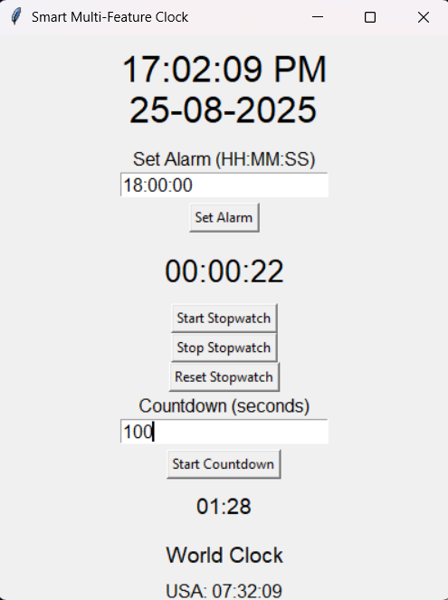

# ⏰ Smart Multi-Feature Clock

A **Python desktop app** built with Tkinter that bundles a Digital Clock, Alarm, Stopwatch, Countdown Timer, and World Clock into one elegant UI. Demonstrates **GUI development**, **multithreading**, and **time zone handling**—skills relevant to production desktop tools.

## 🚀 Features
- **Digital Clock** – Live system time & date
- **Alarm** – Triggers a sound + popup at set time
- **Stopwatch** – Start / stop / reset
- **Countdown** – Custom duration with end alert
- **World Clock** – Live times for India, US Eastern, London

## 🛠 Tech
- Python 3.x, Tkinter
- `threading` for non-blocking UI
- `pytz` for time zones
- `winsound` for alarm (Windows)

## 🖥 Run Locally
```bash
git clone https://github.com/abhiiishek6392/smart-clock.git
cd smart-clock
pip install -r requirements.txt
python smart_clock.py
```
## 📸 Preview


## 💡 Why This Project Stands Out
- Combines multiple time utilities in one app (clock, alarm, stopwatch, countdown, world clock).
- Demonstrates **GUI development**, **threading**, and **time zone handling** in Python.
- Shows ability to build **practical, user-friendly desktop software**.

## 🌱 Future Improvements
- Dark mode UI
- Multiple alarms
- Custom alarm sounds
- Export stopwatch & timer logs

## 👤 Author
Developed by **Abhishek Singh**

